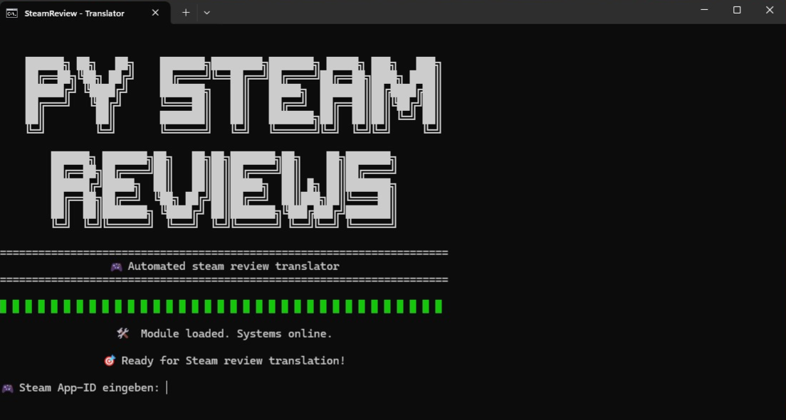
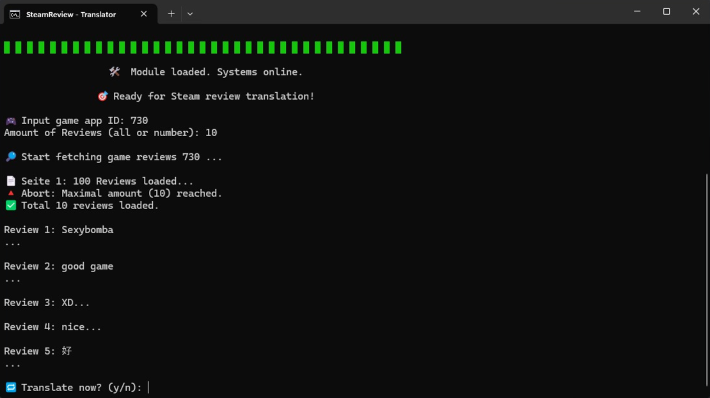

# Py-SteamReviews

🛠️ A Python tool to automatically get, translate and analyze Steam reviews.

---

## Features

- Input for a specific Steam game ID
- Automatic download of all available reviews via the Steam API
- Optional review limit (`all` or custom number), invalid input will set review limit to 100!
- Language detection via `langdetect` to skip German reviews
- Translation via Azure (Key needed)
- Cleans HTML and BBCode from reviews before processing
- Optional CSV export of translated reviews
- Colored and stylized terminal output (ASCII banner + loading bar)
- Modular structure (banner, API fetcher, translation, logging)
- Logfile with per-run statistics

---

## Requirements

- Python 3.12 or newer
- Installed Python packages:
  - `pandas`
  - `requests`
  - `deep_translator`
  - `langdetect`
  - `python-dotenv`

---

## Install the required packages using:

```bash
pip install pandas deepl googletrans python-dotenv
```

---

## Usage

1. Create a .env file and add your DeepL API key:

```env
AZURE_KEY=your_api_key_here
AZURE_REGION=your_region_here
```

2. Run the script:

``` bash
python translate_reviews.py
```

3. Enter a valid Steam App ID (e.g., 730 for CS:GO)



5. Choose how many reviews to fetch (all or a number)

6. Decide whether to translate and/or save the result



8. A .csv file will be saved in the /translations/ folder (if selected)

9. A logfile (translation_log.txt) will track your session

The translated files will be saved into the translations/ folder.
A detailed log file (translation_log.txt) will also be generated automatically.

---
```bash
🎯 Ready for Steam review translation!

Enter the Steam game ID: 730
Amount of Reviews (all or number): 20

✅ Review 1 translated.
⚠️ Skipping review 2 as it is already in German.
...
✅ File saved to: translations/730_translated.csv
```
---

## Future Improvements:

- Web interface for easier interaction

- Support for multiple target languages
